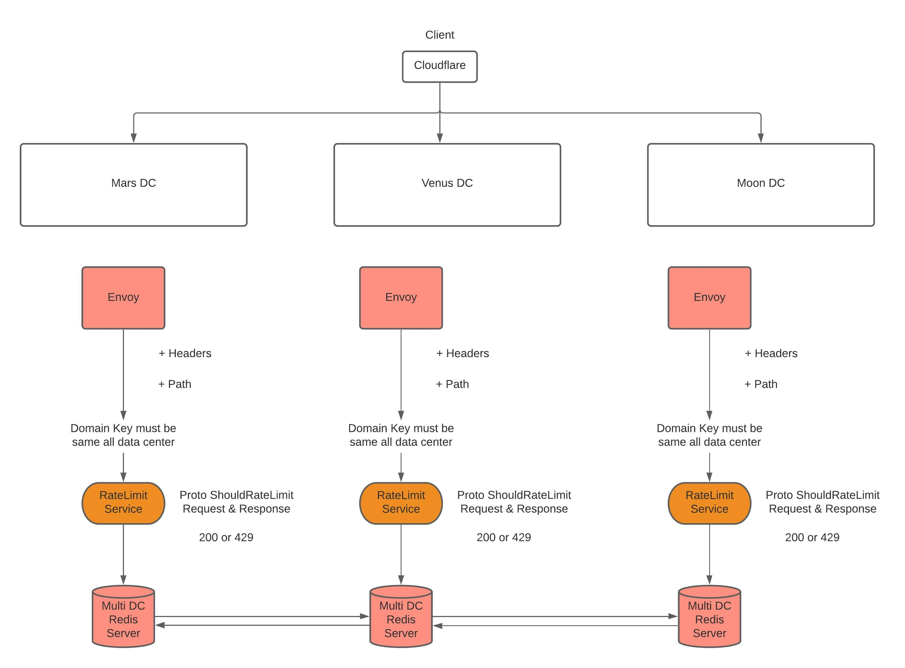

# Rate limits

## Overview

Rate limiting is a means of protecting backend services against unwanted traffic. This can be useful for a variety of different scenarios:

- Protecting against denial-of-service (DoS) attacks by malicious actors
- Protecting against DoS incidents due to bugs in client applications/services
- Login, Sms, Mail Service control

Envoy supports two forms of HTTP rate limiting: local and global.

In local rate limiting, rate limits are enforced by each Envoy instance, without any communication with other Envoys or any external service.

In global rate limiting, an external rate limit service (RLS) is queried by each Envoy via gRPC for rate limit decisions.

## Global Rate Limit Architecture

## Local Rate Limit
See [Local Rate Limit](docs/local-ratelimit.md)

## Global Rate Limit
See [Global Rate Limit](docs/global-ratelimit.md)

## Metrics && Stats
See [Stats](docs/metrics.md)

## Benchmark
See [Local Ratelimit Benchmark](docs/local-ratelimit-benchmark.md)

## Development

You need install operator-sdk framework to develop ratelimit operator.

Operator sdk version:

`operator-sdk version: "v1.6.2", commit: "b131ca8ec77c96b9898470eba9560c30af0f23f3", kubernetes version: "v1.19.4", go version: "go1.16.3", GOOS: "darwin", GOARCH: "amd64"
`

### Create a new API and Controller 

`operator-sdk create api --group trendyol.com --version v1beta1 --kind EgressRateLimit --resource --controller`

### Generating CRD manifests 

`make generate
`

`make manifests
`

For more details click [here](https://sdk.operatorframework.io/docs/building-operators/golang/tutorial/)
