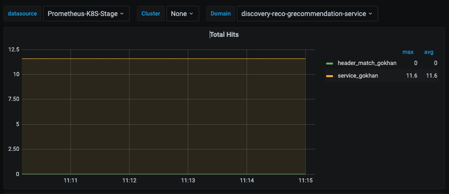
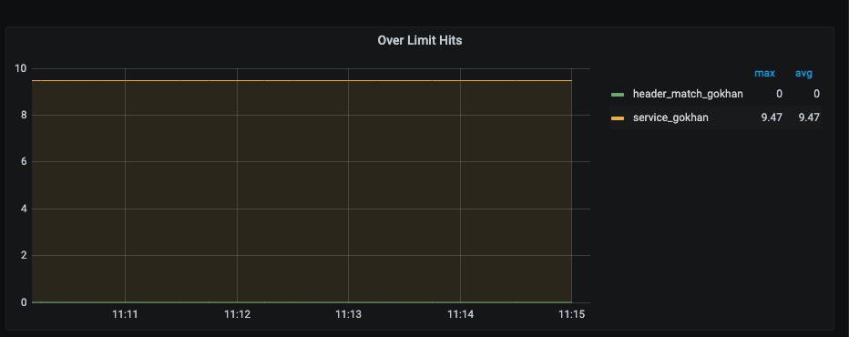
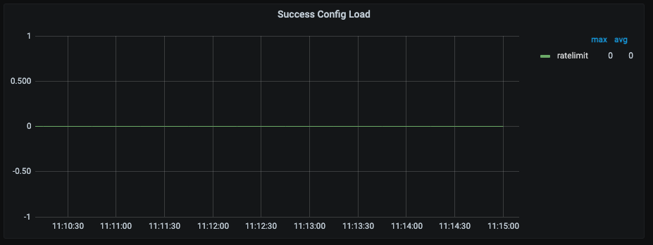

### With StatsD

Rate limit exporter translates StatsD metrics to Prometheus metrics via
configured mapping rules.

    +----------+                         +-------------------+                        +--------------+
    |  StatsD  |---(UDP/TCP repeater)--->|  statsd_exporter  |<---(scrape /metrics)---|  Prometheus  |
    +----------+                         +-------------------+                        +--------------+

## Total Rate limit request

You can see total rate limit request by domain. You can also aggregate metrics by using descriptor key.

## Over Limit request

You can see total rate limit request by domain. You can also aggregate metrics by using descriptor key.

## Runtime Success Configuration 

You can change configuration in runtime. Such as ratelimit `request_per_unit` or you can add new `dimensions`.

